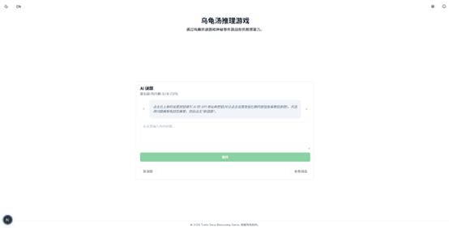

# 乌龟汤推理游戏 | Turtle Soup Reasoning Game

一个基于AI的推理谜题游戏，让玩家通过提问是/否问题来解决神秘场景。



## 项目简介

乌龟汤推理游戏（Turtle Soup）是一种横向思维谜题游戏，玩家需要通过提出是/否问题逐步推理出谜题的真相。这个项目使用AI生成独特谜题，并回答玩家的提问，提供了一个完全交互式的游戏体验。

### 什么是"乌龟汤"？

"乌龟汤"游戏源自"情境谜题"或"横向思维谜题"，但在亚洲某些地区因一个经典例子涉及乌龟汤而得名。游戏中，主持人（在这里是AI）知道完整故事，而玩家只知道初始场景，需要通过提问来发现真相。

### 游戏规则

- 玩家面对一个神秘场景，需要弄清楚"发生了什么"
- 玩家可以提出是/否问题
- AI只会用四种回答之一回应：是、否、是也不是、无关
- 玩家有10次提问机会，需要在限制次数内解决谜题

## 功能特点

- 🎮 AI生成的独特谜题，每次游戏体验都不同
- 🤔 基于提问的推理游戏，锻炼逻辑思维
- 🌐 支持中文和英文界面
- 🎨 深色/浅色模式切换
- 📱 响应式设计，适合多种设备
- 📚 内置游戏教程
- 🔌 支持连接到任何兼容OpenAI API的后端服务

## 安装说明

### 前置要求

- Node.js 16.8.0或更高版本
- npm或pnpm包管理器

### 安装步骤

1. 克隆仓库
   ```bash
   git clone https://github.com/yourusername/turtle-soup-game.git
   cd turtle-soup-game
   ```

2. 安装依赖
   ```bash
   npm install
   # 或使用pnpm
   pnpm install
   ```

3. 启动开发服务器
   ```bash
   npm run dev
   # 或使用pnpm
   pnpm dev
   ```

4. 构建生产版本
   ```bash
   npm run build
   # 或使用pnpm
   pnpm build
   ```

## 使用说明

1. 首次使用需要配置API设置：
   - 点击右上角的设置图标
   - 输入API地址（例如：api.siliconflow.cn）
   - 输入API密钥（可从[硅基流动](https://account.siliconflow.cn/zh/login)获取）
   - 选择问题模型和回答模型
   - 点击保存

2. 游戏开始：
   - 点击"新谜题"按钮生成谜题
   - 阅读谜面，理解初始场景
   - 在文本框中输入问题，点击"提问"
   - 根据AI回答继续探索或推理
   - 达到结论后点击"查看谜底"验证

3. 游戏进阶：
   - 提问时注意措辞，尽量让问题能够用"是/否"回答
   - 关注"是也不是"的回答，它们通常包含关键线索
   - 当收到"无关"回答时，说明该方向与解决谜题无关
   - 注意推理，利用已知信息逐步缩小可能性

## 技术栈

- **前端框架**：Next.js 14 (React)
- **样式**：Tailwind CSS + shadcn/ui组件库
- **状态管理**：React Hooks (useState, useEffect)
- **AI交互**：OpenAI兼容API
- **本地存储**：LocalStorage（保存设置）
- **构建工具**：Turbopack / webpack

## 参与贡献

欢迎贡献代码、报告问题或提出功能建议！请遵循以下步骤：

1. Fork 项目
2. 创建功能分支 (`git checkout -b feature/amazing-feature`)
3. 提交更改 (`git commit -m 'Add some amazing feature'`)
4. 推送到分支 (`git push origin feature/amazing-feature`)
5. 创建Pull Request

## 许可证

本项目采用MIT许可证 - 详情请参见 [LICENSE](LICENSE) 文件。

## 项目截图

*暂时使用占位图，后续会更新实际游戏截图*

---

Made with ❤️ by [ConeF] 